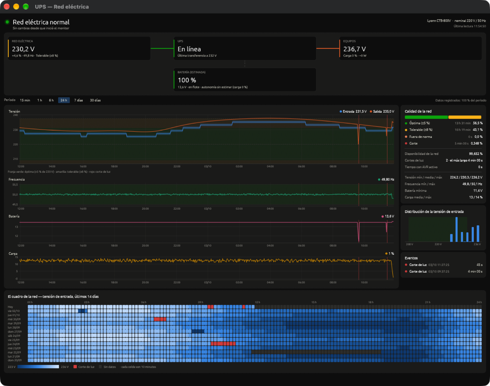

# UPS Monitor — Lyonn CTB-800V (macOS)

Monitor de la red eléctrica y del UPS Lyonn CTB-800V para macOS, escrito en Rust. Vive en la barra de menú, guarda un historial segundo a segundo y lo muestra en un tablero con gráficos. Habla con el UPS por USB HID nativo: no necesita drivers ni el software del fabricante.



*Captura con historial de demostración (sintético) para mostrar cortes y varios días de datos.*

## Qué muestra

- **Barra de menú**: tensión de entrada en vivo (`⚡ 231 V`), o el porcentaje de batería durante un corte (`🔋 85%`). El menú resume el estado y abre el tablero.
- **Camino de la energía**: red → UPS → equipos, con la batería, en vivo.
- **Gráficos** de tensión (entrada y salida), frecuencia, batería y carga, para los últimos 15 minutos, 1 h, 6 h, 24 h, 7 días o 30 días. El cursor se enlaza entre los cuatro y los cortes de luz se marcan en rojo.
- **Calidad de la red** en el período: tiempo en cada banda de tensión, disponibilidad, cortes, tiempo con AVR activo y extremos de cada magnitud.
- **Distribución** de la tensión de entrada.
- **Eventos**: cortes, bajas tensiones, sobretensiones, AVR, batería baja y fallas, con inicio y duración.
- **El cuadro de la red**: 14 días × 24 horas, una celda cada 10 minutos pintada según la tensión media; los cortes en rojo.
- **Notificaciones** cuando se va o vuelve la luz, con batería crítica, falla del UPS o tensión fuera de norma.

| Ícono | Significado |
|---|---|
| ⚡ 231 V | En red, tensión dentro de norma |
| ⚠️ 240 V | En red con AVR activo o tensión fuera de norma |
| 🔋 85% | Corte de luz, corriendo con batería |
| ❌ | Falla en el UPS |
| ⚡ ? | UPS no detectado |

### Bandas de tensión

La nominal se lee del propio UPS (comando `F`; en este equipo, 220 V / 50 Hz).

| Banda | Rango | Con 220 V |
|---|---|---|
| Óptima | ±5 % | 209 – 231 V |
| Tolerable | ±8 % (tolerancia de la distribuidora) | 202,4 – 237,6 V |
| Fuera de norma | más de ±8 % | — |

## Compatibilidad

| Dispositivo | VID | PID |
|---|---|---|
| Lyonn CTB-800V | `0x0665` | `0x5161` |

El chip habla el protocolo Megatec/Voltronic, así que debería funcionar con otros UPS del mismo chipset; solo está probado con el CTB-800V.

## Requisitos

- macOS (probado en macOS 27 sobre Apple Silicon)
- [Rust](https://rustup.rs) 1.89 o superior (solo para compilar)

`hidapi` y SQLite se compilan dentro del binario: no hace falta Homebrew.

## Instalación

```bash
git clone https://github.com/oktubr3/lyonn-ups-monitor.git
cd lyonn-ups-monitor
cargo install --path .
```

Queda instalado en `~/.cargo/bin/ups-monitor`. Con el UPS conectado por USB:

```bash
ups-monitor status
```

## Uso

```
ups-monitor            App de barra de menú (el tablero se abre desde el menú)
    --show             Abre el tablero al iniciar
    --range PERÍODO    Período inicial: 15m, 1h, 6h, 24h, 7d o 30d
    --zoom FACTOR      Tamaño de la interfaz (1 = normal)
ups-monitor status     Estado actual
ups-monitor watch      Estado en tiempo real (Ctrl+C para salir)
ups-monitor events [N] Últimos N eventos registrados (por defecto 20)
ups-monitor raw        Respuestas crudas del UPS (QS y F)
```

- Cerrar la ventana del tablero solo la oculta; la app sigue en la barra de menú. Se sale con **Salir** en el menú.
- Con la app ya corriendo, `ups-monitor --show` abre su tablero en vez de lanzar otra instancia.
- `status`, `watch` y `events` funcionan con la app corriendo (leen lo que ella registra). `raw` necesita el USB libre: hay que salir de la app antes.

## Inicio automático

El LaunchAgent arranca la app al iniciar sesión y la relanza si se cae (no si se sale con **Salir**). Antes de instalarlo, reemplazá `/Users/TU_USUARIO` por tu home (`echo $HOME`) en `com.mauroh.ups-monitor.plist`.

```bash
cp com.mauroh.ups-monitor.plist ~/Library/LaunchAgents/
launchctl bootstrap gui/$(id -u) ~/Library/LaunchAgents/com.mauroh.ups-monitor.plist
```

Para detenerlo:

```bash
launchctl bootout gui/$(id -u)/com.mauroh.ups-monitor
```

Después de actualizar (`cargo install --path .`), reiniciala con:

```bash
launchctl kickstart -k gui/$(id -u)/com.mauroh.ups-monitor
```

## Datos

| Qué | Dónde |
|---|---|
| Historial (SQLite) | `~/Library/Application Support/ups-monitor/history.db` |
| Log de eventos en texto | `~/Library/Logs/ups-monitor.log` |
| Salida de la app bajo launchd | `~/Library/Logs/ups-monitor.out.log` |

El historial guarda una muestra por segundo durante 7 días y, para siempre, un resumen por minuto (medido: unos 33 MB para los 7 días de muestras, más unos 65 MB por año de resúmenes). La variable `UPS_MONITOR_DATA_DIR` permite usar otra carpeta.

## Cómo funciona

El UPS usa el **protocolo Megatec** sobre USB HID (usage page `0xFF00`). La app envía `QS\r` una vez por segundo y parsea la respuesta:

```
(VIN VFALLA VOUT CARGA FREC VBAT TEMP FLAGS
(230.2 232.2 234.6 000 49.8 13.6 --.- 00001001
```

Los ocho flags son, en orden: en batería, batería baja, AVR activo, falla, tipo de UPS, test en curso, apagado programado y beeper. Al conectar también envía `F\r` para leer los valores nominales (`#220.0 002 12.00 50.0`).

Particularidades del CTB-800V observadas con el equipo real:

- No informa temperatura (`--.-`) ni responde al comando de identificación `I`.
- Mide la tensión en pasos de unos 2 V. Por eso la barra de menú y el panel en vivo muestran un valor suavizado; los gráficos y el historial guardan la lectura cruda.
- El porcentaje de batería y la autonomía son **estimaciones** a partir de la tensión de la batería (12 V 7 Ah) y de la carga informada; el UPS no los mide.

### Estructura del código

| Archivo | Qué hace |
|---|---|
| `src/protocol.rs` | Tramas y parseo de `QS` y `F` |
| `src/device.rs` | Lectura y escritura USB HID |
| `src/model.rs` | Bandas de tensión, estado de la red, estimación de batería |
| `src/store.rs` | Historial SQLite: muestras, resúmenes por minuto, eventos |
| `src/monitor.rs` | Hilo de sondeo y detección de eventos |
| `src/notify.rs` | Notificaciones y log de texto |
| `src/gui.rs` | Barra de menú y tablero |
| `src/chart.rs` | Gráfico de series temporales |
| `src/theme.rs` | Paleta |
| `src/cli.rs` | Subcomandos de terminal |

El hilo de sondeo nunca toca la interfaz: publica la última lectura y pide un repintado. Todo lo que es AppKit (ícono, menú, ventana) corre en el hilo principal.

## Desarrollo

```bash
cargo fmt --check
cargo clippy --all-targets -- -D warnings
cargo test
```
